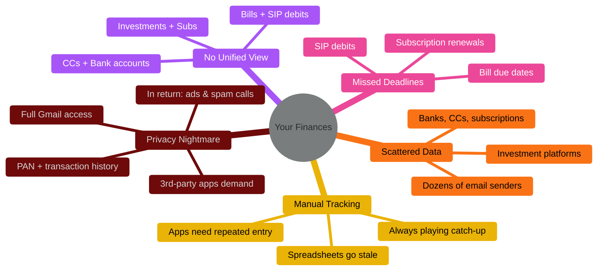
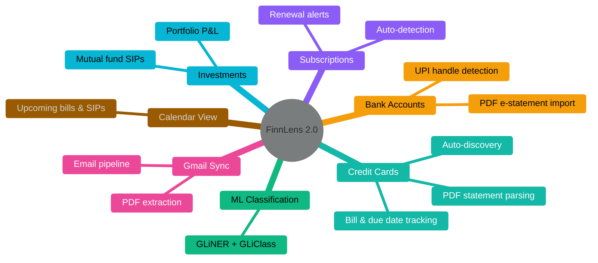

# FinnLens 2.0

 

Your email inbox already knows your finances. FinnLens brings it all together.

---

# The Problem

 

---

# The Solution

 

Your email inbox already knows your finances. FinnLens brings it all together — everything runs on your own machine, no data leaves to a 3rd party.

---

# Features

---

# Architecture

---

# Demo

 

### Mock Demo
### Live Demo

---
