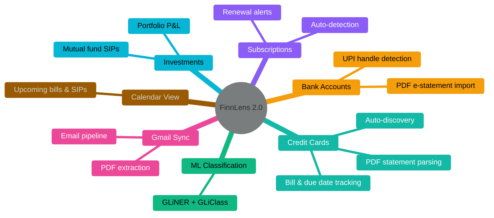

# FinnLens 2.0

 

Your email inbox already knows your finances. FinnLens brings it all together — everything runs on your own machine, no data leaves to a 3rd party.

---

# The Problem

- **Financial data is scattered** across dozens of email senders — banks, credit cards, subscriptions, investment platforms

- **Manual tracking is painful** — spreadsheets go stale, apps require repeated data entry

- **No unified view** across credit cards, bank accounts, investments, and subscriptions

- **Critical dates get missed** — bill due dates, SIP debits, subscription renewals

- **3rd-party apps demand everything, give back nothing** — hand over your bank credentials, transaction history, and PAN number only to get targeted ads and spam calls in return

---

# The Insight

 

> Every financial transaction you make generates an email.
>
> Credit card alerts, bank statements, subscription receipts, investment confirmations — **your inbox is already a financial database.**

 

FinnLens treats Gmail as a **read-only data source** and builds a structured financial profile from what's already there.

**Zero manual entry. Connect once, track everything.**

---

# Features

---

# Architecture

---

# Demo

 

### Live walkthrough:

mock demo: url

---
